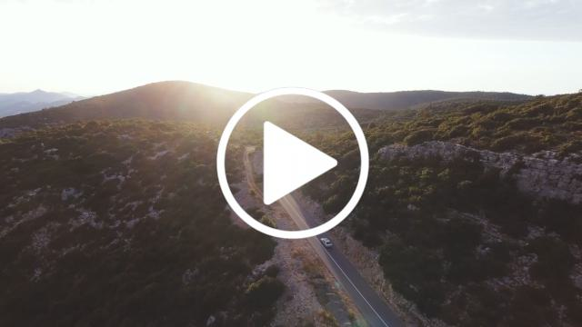

# Get Started


## 📦 Install

First, install the package:

```bash
pip install lite_media_core
```

---

## 🎬 Introduction using a Video

### 1. Download sample video

Grab a ready-to-use video for testing


[](assets/quickstart.mp4)


```python
import requests

url = (
	"https://github.com/rdelillo/lite_media_core/raw/refs"
	"/heads/main/docs/assets/quickstart.mp4"
)
output_path = "video.mp4"

response = requests.get(url, stream=True)
response.raise_for_status()

with open(output_path, "wb") as f:
    for chunk in response.iter_content(chunk_size=8192):
        if chunk:
            f.write(chunk)

print(f"Downloaded {output_path}")
```

### 2. Inspect video metadata

Load the media using lite_media_core:

```python
from lite_media_core import Movie

media = Movie("video.mp4")

assert media.exists

print(f"Path: {media.path}")
print(f"Resolution: {media.resolution}")
print(f"Codec: {media.codec}")
print(f"Duration: {media.duration} ({media.duration.seconds} seconds)")
print(f"Frame rate: {media.frame_rate}")
print(f"Total frames: {int(media.duration)}")

# Full metadata access
print(media.metadata)
```

## 🧩 Next steps

* [Load an image](api/sequence/#image)
* [Load an image sequence](api/sequence/#imagesequence)
* [More info about Movie media](api/movie/)
* [Automatically detect media files and sequences from folders](api/utils/#discover-media-with-mediaos)
